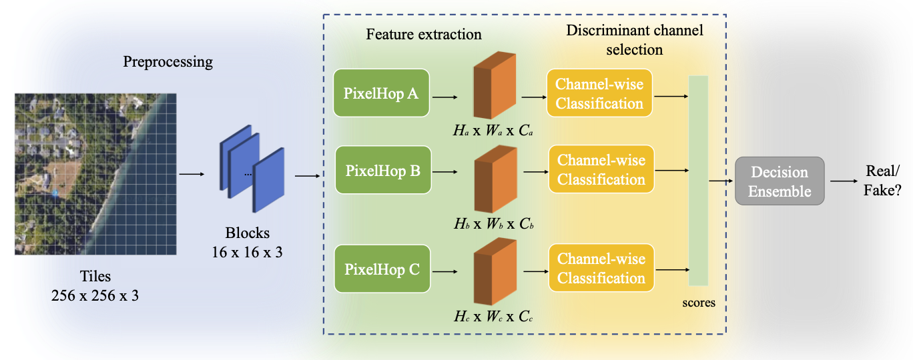

# Geo-DefakeHop: High-Performance Geographic Fake Image Detection

Still Constructing...



A robust fake satellite image detection method, called ["Geo-DefakeHop"](https://arxiv.org/abs/2110.09795), is proposed in this work. Geo-DefakeHop is developed based on the parallel subspace learning (PSL) methodology. PSL maps the input image space into several feature subspaces using multiple filter banks. By exploring response differences of different channels between real and fake images for filter banks, Geo-DefakeHop learns the most discriminant channels based on the validation dataset, uses their soft decision scores as features, and ensemble them to get the final binary decision. Geo-DefakeHop offers a light-weight high-performance solution to fake satellite images detection. The model size of Geo-DefakeHop ranges from 0.8K to 62K parameters depending on different hyper-parameter setting. Experimental results show that Geo-DefakeHop achieves F1-scores higher than 95% under various common image manipulations such as resizing, compression and noise corruption.

## Download the data

[Fake_Satellite_Imagery](https://figshare.com/articles/dataset/Fake_Satellite_Imagery/12197655/2)
[Link text Here](https://link-url-here.org)
[Link text Here](https://link-url-here.org)

## Data structure
```
data
.
├── anti-deepfake-data and code
│   ├── code
│   └── data
│       ├── authentic
│       │   ├── Beijing
│       │   ├── Beijing_128
│       │   ├── Seattle
│       │   ├── Seattle_128
│       │   ├── Tacoma
│       │   └── Tacoma_128
│       ├── base
│       └── fake
│           ├── Beijing_style
│           └── Seattle_style
├── lightGAN-gen
│   ├── images
│   │   ├── Beijing-generated-150
│   │   │   ├── default
│   │   │   └── ema
│   │   ├── Seattle-generated-150
│   │   │   ├── default
│   │   │   └── ema
│   │   └── Tacoma-generated-150
│   │       ├── default
│   │       └── ema
│   └── models
│       ├── Beijing
│       ├── Seattle
│       └── Tacoma
└── styleGAN-attn-gen
    ├── images
    │   ├── Beijing
    │   │   ├── default
    │   │   ├── ema
    │   │   └── mr
    │   ├── Seattle
    │   │   ├── default
    │   │   ├── ema
    │   │   └── mr
    │   └── Tacoma
    │       ├── default
    │       ├── ema
    │       └── mr
    └── models
        ├── Beijing
        ├── Seattle
        └── Tacoma

```

## Cite us
If you use this repository, please consider to cite.
```
@article{chen2021geo,
  title={Geo-DefakeHop: High-Performance Geographic Fake Image Detection},
  author={Chen, Hong-Shuo and Zhang, Kaitai and Hu, Shuowen and You, Suya and Kuo, C-C Jay},
  journal={arXiv preprint arXiv:2110.09795},
  year={2021}
}

@article{zhao2021deep,
  title={Deep fake geography? When geospatial data encounter Artificial Intelligence},
  author={Zhao, Bo and Zhang, Shaozeng and Xu, Chunxue and Sun, Yifan and Deng, Chengbin},
  journal={Cartography and Geographic Information Science},
  volume={48},
  number={4},
  pages={338--352},
  year={2021},
  publisher={Taylor \& Francis}
}
```
## Acknowledgment
This work was supported by the Army Research Labora- tory (ARL) under agreement W911NF2020157. Computation for the work was supported by the University of Southern California’s Center for High Performance Computing (hpc.usc.edu).
